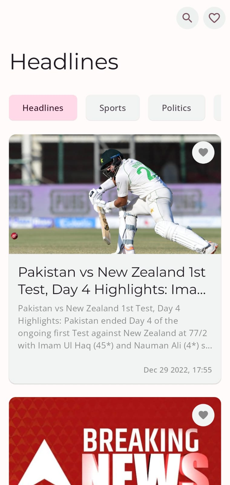
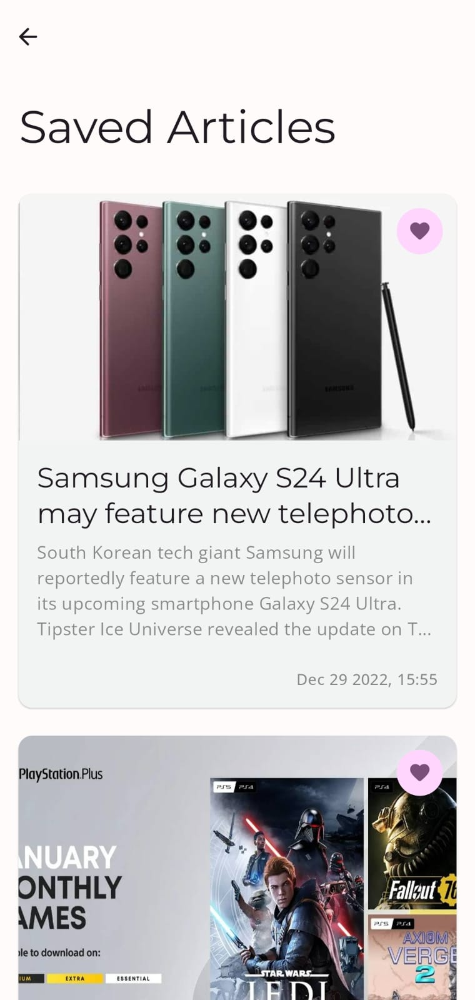
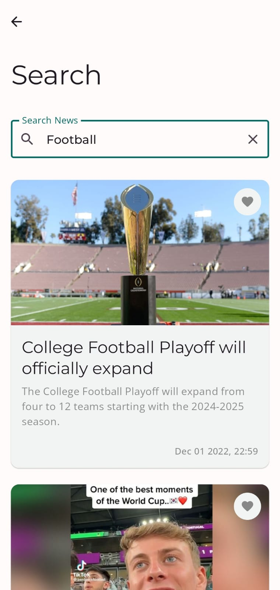
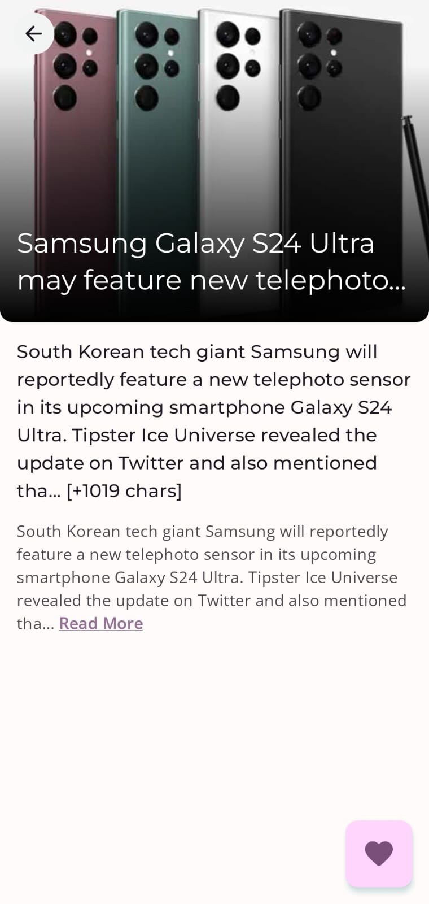

# **News Go** -  Your daily shot of news on the go 🚀   

## About NewsGo
**NewsGo** is a news feed application built using Kotlin Multiplatform Mobile. NewsGo currently offers **Android** and **iOS** Applications with Desktop and Website support to be added soon.

- Material You based theming with dynamic color support in Android App
- Support for both dark and light themes. 🌗
- Clean Code Quality with best practices, great for learning
 
 

## Android App 

## iOS App

## App Features
- Get all the latest news, with options to view from categories like Sports, Tech and many more 
- Save articles to view them offline
- Search from millions of articles and read whatever you want

## ScreenShots 📷

### Android

|   |   |   |   |
|---|---|---|---|
|   |   |   |  |

### iOS

|   |   |   |   |
|---|---|---|---|
|   |   |   | 

## Technical Details 💻

### Shared
- NewsGo's codebase follows [Android's recommended architecture](https://developer.android.com/topic/architecture?gclid=Cj0KCQiAtbqdBhDvARIsAGYnXBOC7uGj6xlSxw5j1p8LtrKKOIgT_HlMrmpW9YV6mn3-4HTbfbV-5SgaAvfKEALw_wcB&gclsrc=aw.ds)
- **Shared ViewModels** as well, so the only thing which is not shared is the UI.
- **Reactive data management** using Kotlin Flows which makes state auto-update when any changes happen in data.
- **Asychronous** handling of data using Kotlin Coroutines.
- NewsGo supports offline caching so you dont have to look at an empty screen while loading 😄
- NewsGo's code follows all the best practices and software development principles like SOLID which makes it a very good learning resource for beginners.
- Code is properly linted using Kt-lint.

### Android
- NewsGo android app is built using Kotlin.
- App User Interface is built using Jetpack Compose. No more XML 😜
- Code follows Dependency Injection practices using Hilt.
- NewsGo's codebase follows [Android's recommended architecture](https://developer.android.com/topic/architecture?gclid=Cj0KCQiAtbqdBhDvARIsAGYnXBOC7uGj6xlSxw5j1p8LtrKKOIgT_HlMrmpW9YV6mn3-4HTbfbV-5SgaAvfKEALw_wcB&gclsrc=aw.ds)
- Material 3 based theming with dynamic colors based on your phone's wallpaper

### iOS 
- NewsGo iOS app is built using Swift.
- User Inteface is built using **Swift UI**
- iOS 16 bases theming.

## Built With 🛠
- [Kotlin](https://kotlinlang.org/) - First class and official programming language for Android development.
- [Kotlin Multiplatform Mobile](https://kotlinlang.org/lp/mobile/) - Kotlin Multiplatform Mobile is an SDK for iOS and Android app development. It offers all the combined benefits of creating cross-platform and native apps.
- [Swift](https://developer.apple.com/swift/) - Swift is a powerful and intuitive programming language for iOS, iPadOS, macOS, tvOS, and watchOS.
- [Swift UI](https://developer.apple.com/xcode/swiftui/) - SwiftUI helps you build great-looking apps across all Apple platforms with the power of Swift — and surprisingly little code.
- [Coroutines](https://kotlinlang.org/docs/reference/coroutines-overview.html) - For asynchronous and more..
- [Flow](https://kotlin.github.io/kotlinx.coroutines/kotlinx-coroutines-core/kotlinx.coroutines.flow/-flow/) - A cold asynchronous data stream that sequentially emits values and completes normally or with an exception.
 - [StateFlow](https://developer.android.com/kotlin/flow/stateflow-and-sharedflow) - StateFlow is a state-holder observable flow that emits the current and new state updates to its collectors.
 - [SharedFlow](https://developer.android.com/kotlin/flow/stateflow-and-sharedflow) - A SharedFlow is a highly-configurable generalization of StateFlow.
- [Android Architecture Components](https://developer.android.com/topic/libraries/architecture) - Collection of libraries that help you design robust, testable, and maintainable apps.
  - [ViewModel](https://developer.android.com/topic/libraries/architecture/viewmodel) - Stores UI-related data that isn't destroyed on UI changes.
- [Dependency Injection](https://developer.android.com/training/dependency-injection) - 
  - [Hilt-Dagger](https://dagger.dev/hilt/) - Standard library to incorporate Dagger dependency injection into an Android application.
  - [Hilt-ViewModel](https://developer.android.com/training/dependency-injection/hilt-jetpack) - DI for injecting `ViewModel`.
- [Timber](https://github.com/JakeWharton/timber) - A simple logging library for android.
- [Coil](https://github.com/coil-kt/coil) - An image loading library for Android backed by Kotlin Coroutines.
- [Material 3 Android](https://developer.android.com/jetpack/androidx/releases/compose-material3) - Material 3 components for Android in Jetpack compose
- [Kotlin Serialization](https://kotlinlang.org/docs/serialization.html) - Kotlin's own Serialization Api.
- [Kotlin DateTime](https://github.com/Kotlin/kotlinx-datetime) - A multiplatform Kotlin library for working with date and time.
- [SQL Delight](https://cashapp.github.io/sqldelight/1.5.4/) - SQLDelight generates typesafe kotlin APIs from your SQL statements.
- [Ktor Client](https://ktor.io/docs/getting-started-ktor-client-multiplatform-mobile.html) - Create asynchronous client and server applications. Anything from microservices to multiplatform HTTP client apps in a simple way.

## Package Structure

### Shared
    
    dev.vaibhav.newsapp     # Root Package
    .
    ├── data                # For data handling.
    |   ├── local           # Database and Local Datasources
    |   ├── remote          # Remote DataSources
    │   ├── model           # Model data classes and mappers, both remote and local entities of Data Layer
    │   └── repo            # Repository Implementations
    |
    ├── domain              # Domain Layer to abstract data layer details from UI   
    |   ├── models          # Model Data Classes for Domain Layer
    │   ├── mappper         # Mappers from Data layer models to Domain Layer models
    |   ├── usecases        # Use-Case Classes for business logic
    |   └── repo            # Repository Definitions
    |
    ├── presentation        # Presentation Layer for UI State and Shared View Model
    |   ├── article         # State and ViewModel for Article Detail Screen. 
    |   ├── saved           # State and ViewModel for Saved Articles Screen. 
    |   ├── home            # State and ViewModel for Home Screen. 
    |   └── search          # State and ViewModel for Search Screen.
    |
    └── utils               # Utility Classes / Kotlin extensions

    sqldelight.database     # Database Package containing all SQL Queries

### Android App

    dev.vaibhav.newsapp.android
    .
    ├── di                  # Dependency Injection             
    │   └── module          # DI Modules
    |
    ├── presentation        # UI/View layer
    |   ├── components      # All UI Components
    |   ├── screens         # All App Screens 
    |   └── theme           # Theming classes
    |
    └── utils               # Utility Classes / Kotlin extensions

### iOS App
    dev.vaibhav.newsapp.iosApp
    .
    ├── ui 
        ├── components      # Ui Components            
        └── screens         # App Screens

## Architecture
This app uses [***MVVM (Model View View-Model)***](https://developer.android.com/jetpack/docs/guide#recommended-app-arch) architecture.

  

---

## If you like my projects and want to support me to build more cool open source projects
  

---

## Contact
If you need any help, you can connect with me.

Visit:- [Vaibhav Jaiswal](https://vaibhavjaiswal.vercel.app/#/)
  

